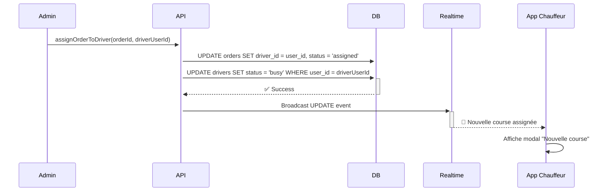
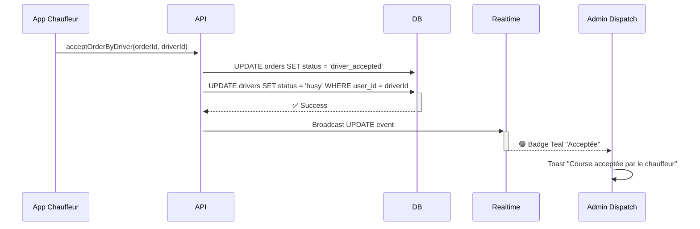
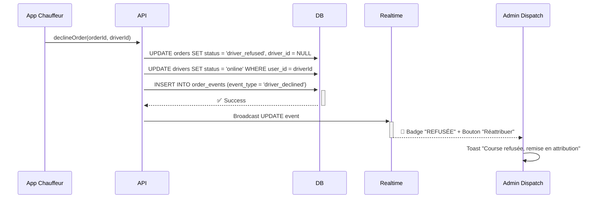

# 📋 ALIGNEMENT AVEC L'APP CHAUFFEUR - DOCUMENTATION COMPLÈTE

**Date**: 2025-12-17  
**Statut**: ✅ Implémenté  
**Architecte**: Senior Full-stack Developer

---

## 🎯 OBJECTIF

Aligner complètement le système de dispatch admin avec l'application mobile chauffeur en utilisant **l'ID Auth (user_id)** comme identifiant pivot et en unifiant les statuts.

---

## 🔑 CHANGEMENTS CRITIQUES

### 1. **Identifiant Pivot : `driver_id` = ID Auth (user_id)**

#### ✅ **AVANT** (Incohérent)
```typescript
// orders.driver_id contenait l'UUID de la table drivers
driver_id: "a1b2c3d4-..." // UUID de la table drivers
```

#### ✅ **APRÈS** (Aligné avec App Chauffeur)
```typescript
// orders.driver_id contient maintenant l'ID Auth (user_id)
driver_id: "auth-user-id-..." // ID Auth de Supabase
```

**Impact** :
- ✅ L'App Chauffeur filtre ses courses avec `driver_id = auth.uid()`
- ✅ Pas besoin de jointure complexe entre `orders` et `drivers`
- ✅ Synchronisation en temps réel simplifiée

---

### 2. **Unification des Statuts**

#### **OrderStatus**

| Ancien Statut | Nouveau Statut | Description |
|--------------|----------------|-------------|
| `pending_acceptance` | `pending_acceptance` | ✅ Inchangé |
| `accepted` | `accepted` | ✅ Inchangé |
| **`dispatched`** | **`assigned`** | 🔄 **CHANGÉ** - Assignée à un chauffeur |
| `driver_accepted` | `driver_accepted` | ✅ Inchangé |
| `driver_refused` | `driver_refused` | ✅ Inchangé |
| ❌ N/A | **`in_progress`** | ✅ **NOUVEAU** - En cours de livraison |
| `delivered` | `delivered` | ✅ Inchangé |
| `cancelled` | `cancelled` | ✅ Inchangé |

#### **DriverStatus**

| Ancien Statut | Nouveau Statut | Description |
|--------------|----------------|-------------|
| `online` / `available` | **`online`** | 🔄 **UNIFIÉ** - En ligne (disponible) |
| `on_delivery` | **`busy`** | 🔄 **CHANGÉ** - Occupé (en course) |
| `offline` | `offline` | ✅ Inchangé |
| `on_break` / `on_vacation` | **`suspended`** | 🔄 **CHANGÉ** - Suspendu |

---

## 📁 FICHIERS MODIFIÉS

### **1. `src/types/orders.ts`**
✅ **Statut**: Modifié

**Changements** :
- `OrderStatus` : Ajout de `'assigned'` et `'in_progress'`, suppression de `'dispatched'`
- `DriverStatus` : Unification sur `'online' | 'busy' | 'offline' | 'suspended'`
- Mise à jour de toutes les fonctions helpers (`getStatusLabel`, `getStatusBadgeColor`, etc.)

```typescript
export type OrderStatus =
    | 'pending_acceptance'
    | 'accepted'
    | 'assigned'           // ✅ Nouveau (remplace 'dispatched')
    | 'driver_accepted'
    | 'driver_refused'
    | 'in_progress'        // ✅ Nouveau
    | 'delivered'
    | 'cancelled';

export type DriverStatus =
    | 'online'             // ✅ Unifié (disponible)
    | 'busy'               // ✅ Nouveau (remplace 'on_delivery')
    | 'offline'
    | 'suspended';         // ✅ Nouveau (remplace 'on_break', 'on_vacation')
```

---

### **2. `src/services/orderAssignment.ts`**
✅ **Statut**: Modifié

**Changements** :
- `assignOrderToDriver()` : Utilise `driverUserId` (ID Auth) pour `driver_id`
- Statut passe à `'assigned'` au lieu de `'dispatched'`
- Vérification des autres commandes mise à jour

```typescript
// AVANT
driver_id: driverId, // UUID de la table drivers
status: 'dispatched'

// APRÈS
driver_id: driverUserId, // ✅ ID Auth (user_id)
status: 'assigned'       // ✅ Nouveau statut
```

---

### **3. `src/services/driverOrderActions.ts`**
✅ **Statut**: Modifié

**Changements** :
- `acceptOrderByDriver()` : Utilise `user_id` au lieu de `id` pour mettre à jour le chauffeur
- `declineOrder()` : Utilise `user_id` avec fallback sur `id` pour compatibilité
- `completeDelivery()` : Utilise `user_id` pour remettre le chauffeur en ligne
- `getDriverOrders()` : Filtre sur `'assigned'` au lieu de `'dispatched'`

```typescript
// Mise à jour du statut chauffeur
await supabase
    .from('drivers')
    .update({ status: 'busy' })
    .eq('user_id', driverId); // ✅ Utilise user_id (ID Auth)

// Fallback pour compatibilité
if (driverError) {
    await supabase
        .from('drivers')
        .update({ status: 'busy' })
        .eq('id', driverId); // Fallback sur UUID
}
```

---

### **4. `src/pages/admin/Dispatch.tsx`**
✅ **Statut**: Partiellement modifié

**Changements** :
- Interface `Order` : Ajout de `refusal_count` et `last_refused_by`
- Type `DispatchColumn` : `'assigned'` au lieu de `'dispatched'`
- Filtres Realtime : `'assigned'` au lieu de `'dispatched'`
- `fetchAllOrders()` : Filtre sur `'assigned'`

**⚠️ Note** : Certaines lignes n'ont pas pu être modifiées automatiquement. Voir section "Actions Manuelles Requises" ci-dessous.

---

### **5. `sql/align_with_driver_app.sql`**
✅ **Statut**: Créé

**Contenu** :
- Mise à jour des contraintes `valid_order_status` et `valid_driver_status`
- Migration des données existantes (`'dispatched'` → `'assigned'`)
- RLS Policies pour permettre à l'admin de modifier les statuts
- RLS Policies pour les chauffeurs (filtrage par `driver_id = auth.uid()`)
- Ajout des colonnes `refusal_count` et `last_refused_by`
- Index pour optimiser les performances
- Documentation complète

---

## 🔒 SÉCURITÉ - RLS POLICIES

### **Admin**
```sql
-- L'admin peut UPDATE les commandes ET les chauffeurs
CREATE POLICY "Admin can update orders" ON orders
FOR UPDATE TO authenticated
USING (EXISTS (SELECT 1 FROM profiles WHERE id = auth.uid() AND role = 'admin'));

CREATE POLICY "Admin can update drivers" ON drivers
FOR UPDATE TO authenticated
USING (EXISTS (SELECT 1 FROM profiles WHERE id = auth.uid() AND role = 'admin'));
```

### **Chauffeurs**
```sql
-- Les chauffeurs voient uniquement LEURS commandes
CREATE POLICY "Drivers can view their assigned orders" ON orders
FOR SELECT TO authenticated
USING (driver_id = auth.uid()); -- ✅ driver_id = ID Auth

-- Les chauffeurs peuvent UPDATE leurs commandes
CREATE POLICY "Drivers can update their assigned orders" ON orders
FOR UPDATE TO authenticated
USING (driver_id = auth.uid())
WITH CHECK (driver_id = auth.uid() OR driver_id IS NULL); -- Permet le refus
```

---

## 🔄 FLUX DE TRAVAIL

### **1. Assignation d'une course**



### **2. Acceptation par le chauffeur**



### **3. Refus par le chauffeur**



---

## ⚠️ ACTIONS MANUELLES REQUISES

### **1. Exécuter le script SQL**
```bash
# Dans Supabase SQL Editor
# Exécuter : sql/align_with_driver_app.sql
```

### **2. Modifications manuelles dans `Dispatch.tsx`**

Certaines lignes n'ont pas pu être modifiées automatiquement. Recherchez et remplacez manuellement :

#### **Ligne ~158** :
```typescript
// AVANT
if (updatedOrder.status === 'dispatched' && oldOrder?.status === 'accepted') {

// APRÈS
if (updatedOrder.status === 'assigned' && oldOrder?.status === 'accepted') {
```

#### **Ligne ~322** :
```typescript
// AVANT
filter: "status=in.(dispatched,driver_accepted,in_progress,driver_refused)"

// APRÈS
filter: "status=in.(assigned,driver_accepted,in_progress,driver_refused)"
```

#### **Ligne ~558** :
```typescript
// AVANT
case 'dispatched':
    dispatched.push(order);

// APRÈS
case 'assigned':
    dispatched.push(order);
```

### **3. Vérifier les autres fichiers**

Recherchez dans tout le projet les occurrences de `'dispatched'` et remplacez par `'assigned'` si nécessaire :

```bash
# PowerShell
Get-ChildItem -Recurse -Include *.ts,*.tsx | Select-String "dispatched" | Select-Object Path, LineNumber, Line
```

---

## ✅ CHECKLIST DE VALIDATION

- [x] `src/types/orders.ts` : Types OrderStatus et DriverStatus unifiés
- [x] `src/services/orderAssignment.ts` : driver_id utilise user_id
- [x] `src/services/driverOrderActions.ts` : Toutes les fonctions utilisent user_id
- [x] `src/pages/admin/Dispatch.tsx` : Interface Order mise à jour
- [x] `sql/align_with_driver_app.sql` : Script SQL créé
- [ ] **MANUEL** : Exécuter le script SQL dans Supabase
- [ ] **MANUEL** : Modifier les lignes restantes dans Dispatch.tsx
- [ ] **MANUEL** : Tester l'assignation d'une course
- [ ] **MANUEL** : Tester l'acceptation par un chauffeur
- [ ] **MANUEL** : Tester le refus par un chauffeur
- [ ] **MANUEL** : Vérifier le badge Teal pour 'driver_accepted'
- [ ] **MANUEL** : Vérifier la réassignation après refus

---

## 🎨 INTERFACE ADMIN - BADGES VISUELS

### **Colonne "En Attribution"**

| Statut | Badge | Couleur | Action |
|--------|-------|---------|--------|
| `assigned` | ⏳ En attente | Amber (animé) | Attendre |
| `driver_refused` | 🚫 REFUSÉE | Red (ring) | **Réattribuer** |

### **Colonne "Acceptées"**

| Statut | Badge | Couleur | Description |
|--------|-------|---------|-------------|
| `driver_accepted` | ✓ Acceptée | **Teal** 🟢 | Chauffeur prêt |

### **Colonne "En Cours"**

| Statut | Badge | Couleur | Description |
|--------|-------|---------|-------------|
| `in_progress` | → En cours | Purple | Livraison en cours |

---

## 🚀 PROCHAINES ÉTAPES

1. ✅ **Exécuter le script SQL** dans Supabase
2. ✅ **Modifier manuellement** les lignes restantes dans `Dispatch.tsx`
3. ✅ **Tester en environnement de développement**
4. ✅ **Vérifier les logs** dans la console pour détecter les erreurs
5. ✅ **Tester avec l'App Chauffeur** pour confirmer la synchronisation
6. ✅ **Déployer en production** une fois validé

---

## 📞 SUPPORT

En cas de problème :
1. Vérifier les logs de la console navigateur
2. Vérifier les logs Supabase (Database > Logs)
3. Vérifier que les RLS policies sont bien en place
4. Vérifier que Realtime est activé sur la table `orders`

---

**Fin de la documentation**  
**Auteur**: Senior Full-stack Developer & Architecte Cloud  
**Date**: 2025-12-17
